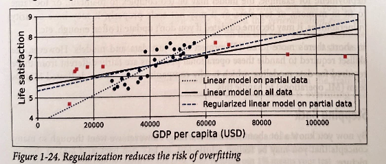
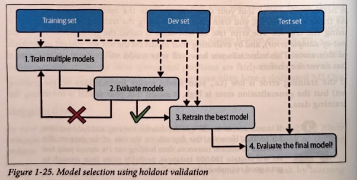
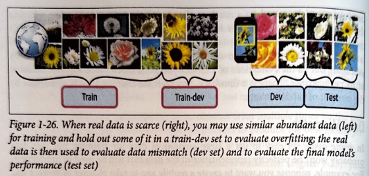

La primera aplicación muy práctica y mainstream del Machine Learning es el filtro de
spam que se implementó de manera masiva en los 90 con el boom del email.

No obstante, antes de esto había aplicaciones un poco más "especializadas" como es el
OCR (Optical Characther Recognition).

Con la mejora de hardware, big data (sobre todo gracias a internet) y con la aparición
de nuevos algortimos, el ML se hizo presente en un montón de aplicaciones.

1. Voice Prompts (Siri)
1. Automatic Translation (Google Traductor)
1. Recomendadores (Netlix, YouTube, todas las RR.SS.) 

Y luego se publicó el paper de Transformer y nació ChatGPT, Gemini etc y ahora mismo
el `chatbot/AI ES EL PRODUCTO`.

¿Que significa que una máquina aprenda?
¿Si yo me descargo toda la Wikipedia en mi ordenador, mi ordenador es más listo?

La respuesta es que NO.

El mundo de ML se puede "dividir" en varios grupos.
1. Supervised (predecir el precio de una casa) vs Unsupervised Learning (segmentar unos clientes).
   La diferencia clave es si le voy a guiar al algoritmo durante el entrenamiento.
1. Online vs Batch Learning.
   Si mi algoritmo puede aprende "poco a poco/on the fly" o en cambia necesitar un "batch" de ejemplos.
1. Instance Based (KNN) vs Model Based Learning (DecisionTree).
   Si voy a "aprender" una regla de los datos (model based) o bien lo que voy a hacer es "comprar" las instancias
   a la hora de hacer una predicción.

Estas técnicas en realidad no son excluyentes sino que un sistema de ML en producción podría una Red Neural que aprendió de
ejemplos clasificados por personas (Supervisados) pero fue entrenado usando un método batch (Batch Learning).

¿Que es el Machine Learning?
`Machine Learning`: es el arte y la ciencia de usar la programación para hacer que nuestras máquinas **APRENDAD DE LOS DATOS**.

Otras definiciones más técnicas del ML son:
`
El ML es el campo que hace que los ordenadores aprendan de los datos SIN SER EXPLICITAMENTE PROGRAMADAS.
`
Arthur Samuel, 1959

Y otra definición un poco más de "ingenería":

`
Decimos que los ordenadores aprenden dada una Experiencia E, para una tarea en concreto T y sus resultados son medibles P si,
el resultado P para la tarea T mejora con E.
`
Tom Mitchell, 1997

Puedes tener un sistema de Machine Learning que va a predecir si tu email es spam o no.
La parte del sistema que aprende y hace predicciones si algo es spam o no se llama el `modelo`. Por ejemplo: un RandomForestClassifier
o una Red Neural se dice que son modelos.

Estos modelos aprenden de datos que se llama `Training Set` (por ejemplos: filas en una tabla).
Cada una de estas filas se llamada `training instance` o `training sample`.

¿Porque necesitamos Machine Learning?
Supongmaos que queremos clasificar si algo es spam o no SIN ML.

Nosotros podríamos mirar un montón de mails de spam, podríamos ver a menudo contienen ciertas palabras: `gratis`, `íncreible` u otras.
También en el nombre del remitente podría contener algún patrón (en vez de poner apple podría poner appple).

Sin ML, tendría que implmentar un montón de `if-else` para poder clasificar un correo como spam.

Vas iterando los dos pasos de antes y despliegas tu sistema.

El spammer a su vez, ve que tiene menos éxito y lo que va a cambiar son sus emails (por ejemplo appple - aapple).

Tu vas a necesitar cambiar tus reglas y es un juego sin fin.

Sin lugar a dudas, tu sistema va a ser MUY MUY COMPLEJO Y TENDRÁ UN MONTÓN DE REGLAS, REGEX, IF-ELSE.

`
Con Machine Learning la gracia está en que no necesitas programar las reglas,
el algoritmo/modelo aprende que es un spam(normalmente son los usuarios quienes han dicho que algo es spam) de los datos sin ser explicitamente programado.
`

Otro uso muy bueno del ML es para problemas que no tienen una solución "fácil" como podría detección de voz.
Si tu quieres un progama que debe detectar la palabra `íncreible` puedes escribir un algoritmo que va medir el sonido y el accento en la í. 
El problema lo tenemos en que esto no va escalar a millones personas de diferentes países y en diferentes entornos.

La mejor solución hoy por hoy es mostrar a un algoritmo miles de millones de ejemplos de muchas palabras y que el aprenda de los datos.

Por último el ML también ayuda a los humanos a aprender. Por ejemplo: despúes de haber visto millones de ejemplos de spam podemos 
inspeccionar nuestro modelo y en este caso ver que combinación de palabras y/o frases hace un spam.

Es decir, ML nos puede revelar nuevas correlaciones o patrones en los datos y nos complementa el `data mining`.

En resumen, Machine Learning es bueno para este tipo de problemas:
1. Cuando tenemos un montón de reglas y listas a mantener (podemos hacer que un modelo aprenda estas reglas de los datos).
1. Entorno muy cambiante. Podemos volver a entrenar nuestro modelo con nuevos datos y actualizarlo.
1. Problemas donde las técnicas tradicionales no danel resultado esperado. Puede ser que un modelo de ML de una mejor solución.
1. Descubrir los patrones en los datos gracias al ML.

Aplicaciones prácticas de Machine Learning.
1. Analizar imágenes en una línea de producción y determinar si tienen o no defecto (CNN, Vision Transformer etc).
1. Chatbot (NLP, RNN, Transformer).
1. Predecir las ventas futuras de una empresa teniendo en cuenta ciertas variables (RandomForest, Redes Neuronales, ARIMA, RNN, Transfomer).
1. Reducir la dimensionalidad de tu dataset para hacer un análisis más rápido (PCA, KMeans).
1. Cluster a tus clientes (DBSCAN, KMeans, Hierarchical Clustering).
1. Detectar fraude (IsolationForest, CatBoost, Red Neuronal).
1. Text summarization (Transformer).
1. Entrenar un agente a que juegue a un juego (Reinforcement Learning).
1. Recomendar productos/vídeos/feed a un cliente: personalización (Collaborative Filtering).

HAY UN MONTÓN DE APLICACIONES PRÁCTICAS DE MACHINE LEARNING ADEMÁS DEL CHATGPT.

Aprendizaje Supervisado

El punto clave para ML Supervisado es la existencia de un target.
En el ejemplo del fichero example_supervised.py el target en nuestra caso es el dataset
llamado `y` y nuestra matrix `X` son nuestras variables.

`X`: se llaman features, variables, atributos.
`y`: se llaman labels, target, éxito.

El target en problemas supervisados puede ser tanto binario (1 - 0: fraude -
no fraude) como números continuos (- infinito - + infinito: predecir
precio de un activo, el número de ventas que tendrás etc etc etc).

Dicho lo anterior, podemos tener problemas de Aprendizaje Supervisado de 
Clasificación o Regresión.

Aprendizaje No Supervisado

En el aprendizaje no supervisado no existe el target `y`, sólo disponemos de
features.

`X`: se llaman features, variables, atributos.
`y`: NO EXISTE.

Cuando quieres DESCUBRIR tus datos. Dejas hablar a los datos.
Por ejemplo: tengo clientes que visitan mi página web y me gustaría segmentar
a estos clientes en diferentes grupos para personalizar su página web.

Una tarea relacionada con Aprendizaje No Supervisado son las técnicas
de `reducción de la dimensionalidad` (si yo tengo una dataset muy grande (miles de columnas)
como puedo yo "entender" mi dataset de manera más rápida).
Esto se consigue, "proyectando" tu dataset a menos dismensiones (se parece
como una algoritmo de compresión tipo .zip pero no es loseless).
¡ HAY PÉRDIDA DE INFORMACIÓN !

A veces puede ser buena idea, ejecutar una reducción de la dimensionalidad
antes de entrenar un modelo final de clasificaicón o regresión.
Irá más rápido, ocupará menos espacion y/o puede mejorar el resultado.

CUANDO ES MALA IDEA: si trabajas en un entorno regulado y ojo que a veces
la pérdida de información puede ser muy relevante.
¡No toméis el ejemplo de [example_dimensionality_reduction.py](./example_dimensionality_reduction.py)
como ejemplo, los datasets de la vida real son mucho más complejos!

*Normlamente, se usan algorimtos de Unsupervised Learning y/o Reducción de la dimensionalidad como un paso
intermedio en un proyecto de Data Science. (Muchas veces no es el fin en si mismo, sino un medio).*

---

Dentro del mundo de Aprendizaje no Supervisado tenemos "Anomaly Detection" que consiste en encontrar instancias "raras/anómalas" 
dentro de tu dataset. 

Básicamente estos algoritmos, durante el entrenamiento (fit) aprenden a reconocer los patrones "normales/habituales" y cuando
se le muestra nuevas instancias, el algoritmo determina si es o no "anólama" (un ejemplo sería el IsolationForest).

Para más información pueden leer esta [página web](https://scikit-learn.org/stable/modules/outlier_detection.html).

---

Una tarea muy parecida a la anterior es "Novelty Detection". El funcionamiento es muy parecido, durante el fit del modelo
el dataset debe ser muy "limpio" (no debe contener cosas "raros"). De esta manera, el modelo aprende las características de 
las instancias "habituales" y luego es capaz de detectar cualquier novedad.

Por último, tenemos "Association Rule Learning": sirve para analizar grandes volumenes de datos. Un posible caso de uso sería: 
le muestras las ventas de tu tienda al algoritmo y el aprende que cuando se compra salsa barcaboca y patatas chips también se compra
carne. El algoritmo te ayuda en este caso a repensar la distribuciónd de los artículos en la tienda (ponerlos más cerca uno del otro).

---
Semi-supervised Learning: etiquetar los datos en la vida real es muy costoso por este motivo es muy habitual encontrarse con muchos
datos que no tienen el "target" o la "etiqueta". 

No obstante, tu sí que podrías etiquetar unas pocas instancias. Una vez que haces esto, estas etiquetas se pueden propagar al resto
de instancias que el algoritmo detecta que son iguales.

Ejemplo: subes un montón de fotos a Google Foto y un algoritmo no supervisado detecta que la persona A aparece en la foto 1, 2, 33.
Con etiquetar 1 vez esta persona, el algoritmo automáticamente las clasifica a todas. De esta manera podemos llegar a etiquetar todas las
fotos muy rápido y posteriomente utilizar una algoritmo supervisado.

---

Self-supervised Learning: el propio algoritmo aprende a etiquetar los datos.
Por ejemplo: supongamos que tenemos un montón de fotos con diferentes mascotas. Podemos manipular las fotos y ocultar parte de las fotos.
De esta manera, podemos llegar a entrenar un algoritmo que debe aprender a reconstruir esta foto. 

El input en el algoritmo es la foto con una parte oculta y el target es la foto original.
Cuando entrenamos el algoritmo, el será capaz de distinguir entre diferentes mascotas. 

Posteriormente puedes llegar a "especializar" el algoritmo en predecir las diferentes tipos de mascotas. 
Tendrás que suministrar fotos etiquetadas con perros, gatos, peces etc, pero la cantidad será mucho menor porque el algoritmo ya
sabe que es cada mascota (porque cuando reconstruye la foto de un gato no le pone la cara de un perro).

Básicamente estamos usando una técnica de "Transfer Learning".

ChatGPT es un modelo self-supervised porque durante el entrenamiento parte del texto que se muestra al algoritmo está reemplazado/oculto
y el modelo debe aprender a predecir la palabra más probable.

En cierto aspecto, self-supervised se parece mucho a tareas supervisadas (se usa en clasificación o regresión) pero también se parece
a no supervisado (porque usas datasets sin etiquetas). Por este motivo es mejor dejarlo en su propia categoría.

---
Reinforcement Learning: es una bestia aparte. En el contexto de RF, hay un agente (agent) que interactua con el ambiente y nosotros le damos
feedback. Cuando el agente hace algo malo se le penaliza (penalty) y cuando hace una tarea bien se le da un premio (reward).
De esta manera el algoritmo aprende por si sólo cual es la mejor decisión a tomar en cada situación (policy).

Ejemplo de algoritmos de RF: [AlphaGo](https://es.wikipedia.org/wiki/AlphaGo#cite_note-1) el algoritmo aprende a jugar al juego de Go por
su cuenta (tras millones de partidas) y muy rápidamente es capaz de ganar a los mejores
[jugadores del mundo](https://www.youtube.com/watch?v=WXuK6gekU1Y&list=PLqYmG7hTraZBy7J_4ynYPc0Ml1RUGcLmD&index=1).

---
Otra forma de clasificar los sistemas de Machine Learning es `online` vs `batch`.

Un algoritmo online es capaz de aprender de un flujo de datos (por ejemplo a través de Gradient Descend).
Otros en cambio sólo puede aprender usando el dataset completo (batch) (por ejemplo Randon Forest).

---
Batch Learning: le muestras al modelo todos los datos que tienes disponibles para que aprenda.
Pasado el train, el modelo se despliega en producción y en este caso ya no se le muestra nuevos ejemplos (para que se actualice).
Sólo predice lo que había visto en el dataset de train. Muchas veces, este tipo de soluciones sirve para la mayoría de los casos. 

Ahora bien, algunas limitaciones de este enfoque:
1. Por lo general, los modelos se deterioran en producción con el tiempo (el mundo sigue cambiando). En este caso, si detectamos que hay
   `data drift/model rot` debemos reentrenar nuestro algoritmo con los datos viejos y con los datos nuevos.
1. Si me modelo debe trabajar con entornos muy cambiantes (predecir la bolsa), quizás no es el mejor enforque porque tendré que reentrenar
   muy a menudo mi modelo y esto lleva tiempo y cuesta dinero.
1. Entrenar este tipo de modelos es muy costoso porque implica grandes volumenes de datos y por lo tanto CPU, memoria etc. 
1. Si mi modelo se debe desplegar en un edge device (smartphone) cuando tenga que reentenar mi model, también tengo que tener los datos
   originales. Esto por lo tanto consumirá mucho espacio en el dispositivo y no es lo ideal.

---
Un sistema online es aquel que aprende o bien de un flujo de 1 instancia o bien de un mini grupo de instancias (llamados mini-batches).
Una de las ventajas principales es que puedes aprender de datasets masivos que no caben en memoria (out of core learning).
Una técnica de online learning es [gradient descent](https://en.wikipedia.org/wiki/Gradient_descent) pero hay otras.

Normalmente, se entrena un modelo en un entorno offline (pero puede ser con mini batches) y se despliega en producción pero el modelo
se actualiza (en producción) con los nuevos datos que ve.

Por ejemplo: un sistema de detección de spam, ve nuevos ejemplos de spam y se actualiza online.

Uno de los paramétros clave es la `learning rate` es una paramétro que le dice al modelo "como de rápido se tiene que actualizar a los
nuevos datos".

Si le pones `lr` alta, el modelo se actualiza muy rápido a los nuevos datos y se olvida de los viejos (se llama Catastrophic Forgetting).
Si le pones `lr` baja, el modelo tiene más inercia y se actualiza poco a poco. 

Uno de los principales retos de online learning es mostrarle datos malos cuando está en producción y hacer que su performace baje.
Por ejemplo: alguien intenta engañar a un sistema de spam o de búsqueda.

En estos casos, es importante monitorizar nuestro sistema y cuando su performance baja, apagar el aprendizaje online y cambiar a la versión
anterior.

Lo mismo debemos hacer con los datos, monitorizar y detectar outliers (por ejemplo con un algoritmo de `Anomaly Detection`)
Uno de los principales retos de online learning es mostrarle datos malos cuando está en producción y hacer que su performace baje.
Por ejemplo: alguien intenta engañar a un sistema de spam o de búsqueda.

En estos casos, es importante monitorizar nuestro sistema y cuando su performance baja, apagar el aprendizaje online y cambiar a la versión
anterior.

Lo mismo debemos hacer con los datos, monitorizar y detectar outliers (por ejemplo con un algoritmo de `Anomaly Detection`).

---
Otra forma de clasificar los sistemas de ML es en función de su forma de generalizar.

En este aspecto tenemos 2 grande grupos: aprendizaje basado en instancias (Instance Based) y aprendizaje basado en modelos (Model Based).

Un ejemplo de aprendizaje basado en instancias lo tenemos en [este script](./example_instance_based_learning.py) y un ejemplo de
Model Based learning es [este otro script](./example_supervised.py).

La diferencia principal entre Instance Based y Model Based consiste en que en el primer caso, nos basamos en una [métrica de similitud](https://es.wikipedia.org/wiki/Medida_de_similitud)
a la hora de clasificar o predecir.

Debido a esto, para clasificar necesitamos el dataset de "entrenamiento/origen" para poder calcular la similitud y asignar esta etiqueta.
Mientras que en el Model Based, tenemos un algoritmo que "aprendió" las relaciones durante el entrenamiento y es capaz de utilizar este
conocimiento para clasificar/predecir nuevas instancias. NO necesitas el dataset de origen y su deploy y escalabilidad es mucho más fácil.
Ver el [script de regresión linear](./example_happiness.py)

Cuando tienes un modelo entrenado y haces una predicción con nuevos datos (nuevas instancias) se llama `inferencia`.

---
Retos de un proyecto de Machine Learning

Los principales retos son: `malos datos` o `malos algoritmos`.

Retos de lado de los datos:
1. Datos insuficientes: según este [paper de 2001](https://ismailouahbi.medium.com/data-related-problems-ml-part-i-b59a49d947ea) diferentes
   algoritmos acaban teniendo un resultado muy parecido siempre y cuando le suministras la cantidad necesaria de los datos.
   [Paper original](https://dl.acm.org/doi/10.3115/1073012.1073017)
1. Datos no representativos: si nuestros datos de entrenamiento no contienen todos los ejemplos que queremos que el modelo generalice.
   Puede llegar a pasar que cuando haces una predicción tu modelo se "queda corto" porque no ha visto este tipo de ejemplos.
   Por ejemplo: si en nuestro [script ./example_happiness.py](./example_happiness.py) hubiesemos cogido para entrenar únicamente países 
   "ni muy pobres ni muy ricos" el modelo no sería capaz de hacer buenas predicciones para países muy pobres o muy ricos.
   Si tienes pocos datos puedes llegar a tener "sampling noise" y si tienes muchos datos, también te puede pasar que tu dataset no es
   representativo porque contiene "sampling biase".
   Uno de los ejemplos más famosos de "sampling biase" es la campaña electoral de [EEUU en 1936](https://en.wikipedia.org/wiki/1936_United_States_presidential_election)
1. Problemas de Data Quality. Ejemplos cuando tenemos que lidiar con temas de data quality: outliers y/o valores nulos.
1. Varialbes/Datos irrelevantes. `Gargabe In, Gargabe Out`: debemos poner mucho cuidado en las variables que vamos a usar.
   Si nuestro dataset contiene muchas variables que no son relevantes, el modelo podría no ser capaz de aprender los patrones que nos interesan.
   Al rescate viene el Feature Engineering que consiste en:
      1. Feature Selection: elige las mejores variables dentro de las disponibles para entrenar tu modelo.
      1. Feature Extraction: combina las variables para crear nuevas y más útiles.
      1. Create nuevas variables obteniendo más datos.

Retos de lado de los algoritmos:
1. Overfitting: cuando el modelo memoriza el dataset de entrenamiento y no es capaz de generalizar bien. 
   Un ejemplo sería que en nuestro modelo de [script de regresión linear](./example_happiness.py) vamos a meter el nombre del país como feature.
   Un modelo complejo, podría detectar que cuando tenemos `w` en el nombre del país (New Zealand, Norway, Sweden etc)
   la calidad de vida es muy alta. No obstante, esto es "puro ruido" en los datos (la presencia de `w` en el nombre del país no significa que sus habitantes van
   a ser más felices) pero el modelo de no lo sabe y acaba aprendiendo este "ruido" de los datos.
   En este caso, no podrá predecir bien la "felicidad" en un país como `Rwanda` y/o `Zimbabwe`.
   Algunos remedios:
      1. Simplifa el modelo.
      1. Añade restricciones al modelo (L1 o L2 regularización).
         En nuestro ejemplo de regresión lineal, nuestro modelo tiene 2 parametros.
         Decimos que tiene 2 grados del libertad.
         Si queremos un modelo más simple, podemos forzar a que la constante sea 0.
         En este caso, el modelo será más simple pero quizás no va a generalizar del todo bien.
         `Debemos encontrar el equilibrio entrenar nuestro modelo con todos los datos y que este sea sencillo/simple para mantener.`
      1. Selecciona menos atributos/variables para tu modelo.
      1. Obten más datos.
      1. Reduce el ruido/limpia los datos. 

Ejemplo de regularización y como es capaz de generalizar mejor que otro modelo sin restricciones.

1. Underfitting: se puede dar cuando no tienes datos suficientes y el modelo no aprende ningún patrón y por lo tanto tampoco generaliza bien se puede dar cuando no tienes datos suficientes y el modelo no aprende ningún patrón y por lo tanto tampoco generaliza bien. 
   También se da cuando el modelo es demasiado sencillo y no es capaz de aprender los patrones de los datos.
   Algunos remedios:
     1. Más datos, mejores features.
     1. Modelo más potente con más paramétros. 
     1. Menos regularización.
1. Deployment: puedes tener datos y puedes tener buen modelo pero cuando lo pones en producción pueden surgir nuevos problemas. 
     1. Problemas de seguridad.
     1. Latencia.
     1. El modelo se queda obsoleto.
     1. El modelo consume demasiados recursos etc 
   La disciplina que se encarga de la operativización de los modelos de ML se llama `MLOps`.

---
SUPER MEGA CORE:
Testing and Validation
El objetivo de un modelo es predecir bien nuevos ejemplos en producción.
¿Como podemos saber si lo hace bien?
Podemos ponerlo en producción y medir los resultados.
Pero no es la mejor decisión porque si el modelo es muy malo, los usuarios se van a quejar.

No debemos esperar a que nuestro modelo generaliza bien, lo debemos medir con datos.
Por este motivo, cuando yo tengo un dataset para entrenar, lo mejor es "separarlo" en otro dataset que usaré para testear lo bien que generaliza mi modelo.

Dentro de [este script](./example_instance_based_learning.py) hemos usado la función de "train_test_split" para separar nuestro dataset en 2.
Esto es muy relevante porque voy a usar el dataset de test para ver cual es mi "generalization error/out of sample error".
Si mi modelo funciona bien sobre el dataset de train y mal sobre el dataset de test, significa que ha overfitteado sobre el dataset de train y por lo tanto es muy
díficil que haga buenas predicciones en producción (nuevos casos).

Por el otro lado, muchas veces vamos a volver a separar nuestro dataset de train para obtener otro dataset llamado "validation/development set".
¿Porque?
A veces tenemos que elegir entre diferentes modelos y queremos que estos generalicen bien.
El problema viene a que para elegir entre estos modelos y/o hiperparámetros vamos a "consultar" sus resultados.

Si para ellos usamos el dataset de test, en realidad lo que vamos a hacer es acabar "puliendo" el modelo para que ajuste bien este dataset
pero quizás no generaliza del todo bien. Hacemos como una especia de "overfitting" sobre test.

No es lo ideal.

En cambio, si usamos este validation/development set, podemos hacer todas las pruebas que queramos porque consultaremos el test set sólo unas pocas veces.

En resumen:
Tengo un dataset de 100 filas. Lo separo en:
   1. Train set: se usa para entrenar el modelo (por ejemplo 70 filas). Se puede consultar muchas veces.
   1. Validation set: se usa para elegir entre un algoritmo u otro y sus hiperparams (10 filas).  Se puede consultar muchas veces.
   1. Test set: se usa SÓLO para comprobar que el modelo generaliza bien. Se deben consultar muy pocas veces..

En la práctica, cuando eliges el algoritmo y sus params (usando el dataset de train y validation), volverás a entrenar tu modelo sobre un dataset que contiene X_train y X_validation (80 filas).
Esto le puede ayudar a mejorar un poco más al modelo.

Nunca debemos usar el X_test para elegir, entrenar o tunear nuestro modelo. Sólo lo usamos para ver que generaliza bien.

Podemos llegar a tener otro problema: ¿como podemos saber si un modelo funciona mal por temas de hiperparámetros o es un tema de datos?
La regla de oro es tener en tu dataset de validation y test los datos más cercanos a "producción".
La solución sería usar otro dataset llamado `train-dev set`.
Tengo un dataset de 100 filas. Lo separo en:
   1. Train set: se usa para entrenar el modelo (por ejemplo 60 filas). Se puede consultar muchas veces.
   1. Train dev set: se usa para descartar si tenemos un problema de paramétros o data mismatch.
      Si después de entrenar un modelo, este se comporta mal sobre el train-dev set, significa que hemos overfitteado nuestro modelo.
      Vuelvo al train set para ir ajustando sus paramétros. Se puede consultar muchas veces.
   1. Validation set: si mi modelo se comporta mal sobre este dataset, significa que tengo un data mismatch. (10 filas).
      La solcuión sería preprocesar los datos para que se ajuste lo mejor posible a los datos en producción. Se puede consultar muchas veces.
   1. Test set: se usa SÓLO para comprobar que el modelo generaliza bien. Se deben consultar muy pocas veces.

---
**No Free Lunch Theorem**
Nuestros modelos son una simplificación de la realidad.
En este aspecto, muchas veces asumimos ciertas cosas los datos y el problema que intentamos resolver.
Si eliges un modelo lineal, significa que asumes que la distancia entre tus datos y la recta es puro "ruido".
En el paper [de David Wolpert](https://direct.mit.edu/neco/article-abstract/8/7/1341/6016/The-Lack-of-A-Priori-Distinctions-Between-Learning?redirectedFrom=fulltext)
el autor demuestra que si no haces ninguna asunción sobre los datos, te debería dar igual elegir un modelo u otro.
No hay ningún modelo que a priori sabes que va a funcionar mejor que otro para este dataset.
Esto significa que vamos a tirar todos los modelos y elegimos el mejor. En práctica esto no se puede hacer (tardaríamos mucho tiempo).
Por este motivo, asumes ciertas cosas y vas a evaluar únicamente algunos algoritmos.
Para problemas sencillos vas a usar un modelo lineal y para problemas más complejos, una red neuronal.

Fin del capítulo 1

